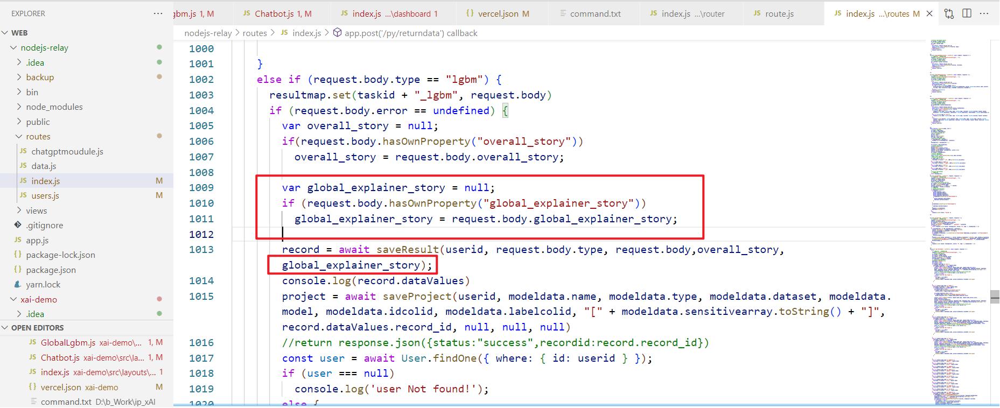
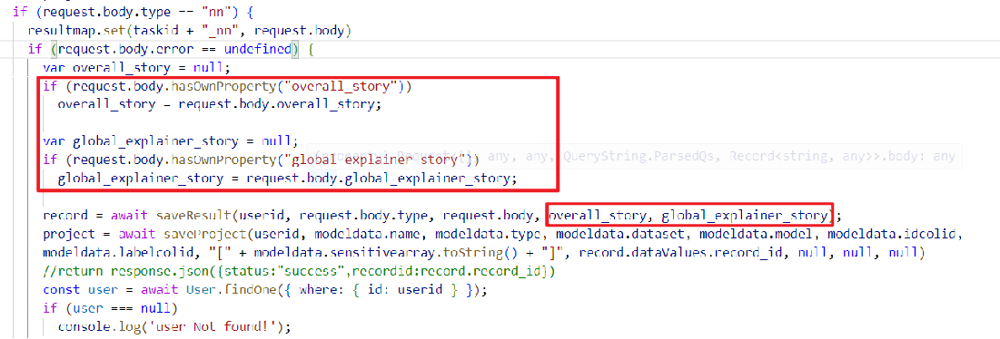
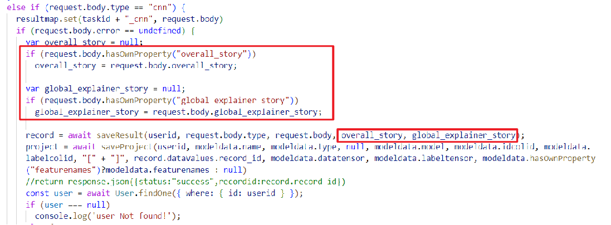
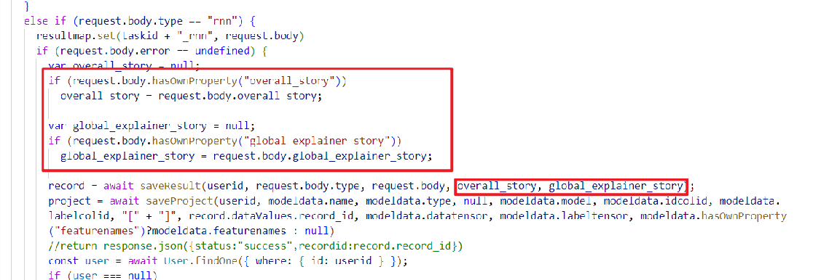

# Branch Documentation

ZhuohuaHUANG

I mainly added the "global_explainer_story" and extended the DNN, CNN and RNN for the chatbot to store more information of the SHAP diagram into the database.

Stored “global_explainer_story” into database

Extended the DNN, CNN and RNN parts on Nodejs-relay, and made it possiable to:
Request "overall_story" and “global_explainer_story”.
Store "overall_story" and “global_explainer_story” in to database.

